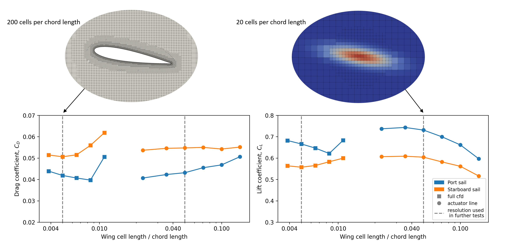

# Actuator line

An actuator line model shares a lot of the same principles as a lifting line model; the wings are divided into line segments, and the forces on each line segment are dependent on the local velocity and the sectional models. However, unlike a lifting line simulation, there is no potential theory wake. The velocity at each control point is instead estimated directly from the velocity field in a CFD solver. The benefit of this is that other structures may influence the felt velocity at each control point. For the sake of sail simulations, this allows for modeling the interaction effects between the deck and superstructure and the sails.

Lift-induced velocities due to the calculated forces on the sails are still included in the model. This happens through a force projection step, where the calculated forces on each line segment are projected back onto the CFD grid as body forces with a volumetric distribution. This creates a two-way coupling: the flow to the sails are affected by anything else in the CFD domain, and the flow over all other structures are affected by the forces from the sails.

<figure>
    
    <figcaption>Figure 1: Examples of streamlines around wing sails on a ship that are simulated with the actuator line method. The interaction between the ship and the sails is in this case taken into account</figcaption>
</figure>

## What are the benefits?
An actuator line simulation is significantly slower than a lifting line simulation. In practical terms, what takes a few milliseconds with a lifting line model will take minutes for wings alone, and even hours if the superstructure is included, with an actuator line model. However, it is still significantly faster than a full CFD simulation where the wings are directly represented in the mesh. An example of the difference in mesh resolution can be seen in Figure 2, which comes from [this paper](https://www.researchgate.net/publication/374976524_Actuator_Line_for_Wind_Propulsion_Modelling). In general, an actuator line can represent the wings with an order of magnitude larger cells than a fully resolved wing. This comes from the fact that the boundary layer and geometry is not modeled directly. Rather, the forces on a section of the wing is simplified to mostly depend on the local velocity at each control point.

<figure>
    
    <figcaption>Figure 2: Examples of a convergence study done for both a fully resolved wing and for an actuator model of the same wing </figcaption>
</figure>

## What should an actuator line model be used for?

Since the computational speed is measured in terms of minutes to hours, it is generally not a method that is fast enough for running directly in a route simulation. The recommended work flow for setting up a complete model of a wind propulsion device is therefore to use a combination of methods.

More specifically, an actuator line model can be used to measure the interaction between the sails and the rest of the ship for a few different operational conditions. This data can then later be used to make correction factor for a lifting line model. One approach for doing this is explained later, for the [effective wind model](../utils/wind_model.md) functionality of the library. The correction factors tuned based on actuator line simulations can then later be interpolated on for wind conditions not directly tested. As such, **the main point of the actuator line model is to provide a computationally effective way to measure interaction effects between sails and the rest of the ship, which later can be used to tune correction factors for faster lifting line models**.

## Why not just measure the velocity over the ship without any sails present?

The effective velocity over a ship superstructure can also be measured in a CFD simulation with the ship alone, without any sails. In this case, the measured velocity at the locations where the sails should stand can be used as input to  a lifting line model directly.

**This type of simplified modeling is likely sufficient for many cases**. However, one missing effect with this approach is the two-way coupling between the flow over the sails and the flow over the rest of the ship. The sails themselves might alter how the flow is separating and accelerated over the deck and past the superstructure. This effect should be captured better with an actuator line model due to the projection of the calculated forces back onto the CFD grid. Whether it is significant or not will likely depend on the specific ship, sail configuration, and sail type. However, an actuator line model is relatively cheap to add to a simulation that is anyhow simulating the rest of the ship. It is, therefore, not much added computational time to test the full two-way coupling.
