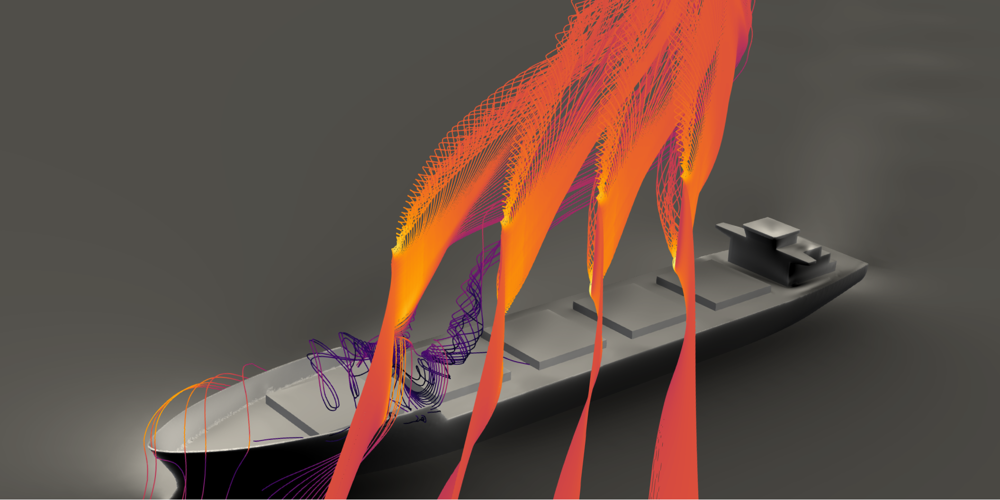

# Introduction

Welcome to the Stormbird book!

Stormbird is a library for simulating lifting surfaces, e.g., wings, in a simplified way by representing them as *line-models*. Although this can be used for a variety of different cases, it is mostly developed to offer efficient modeling of *modern wind propulsion devices*. That is, the following types of lifting surfaces are of particular interest:

1) Wing sails
2) Rotor sails
3) Suction sails
4) Kites

<figure>
    
    <figcaption>Figure 1: Examples of stramlines around wing sails that are simualted with this library.</figcaption>
</figure>

To achieve practical modeling capabilities for these use cases, the following physical effects are assumed to be particularly important:
- **Various lift generation mechanisms**: modern sails have *sections* that range from classical foils, with and without flaps, rotating cylinders, and foils with boundary layer suction.
- **Strong viscous effects:** For all lift generating mechanisms above, there will be high lift coefficients with strong viscous effects on both the lift and drag forces. For instance, wing sails tend to be operated close to stall, the lift on a rotating cylinder is strongly affected by partial flow separation, and the lift on a suction sail is very dependent on the amount of boundary layer suction.
- **Interaction effects between lifting surfaces:** Many wind-powered ships have several sails placed in close proximity. Interaction effects between multiple sails can therefore be important.
- **Interaction effects with other structures:** Independent of the number of sails, there can be interaction effects between the sails and the rest of the ship, such as structures on deck or the part of the hull that is above the water line.
- **Unsteady effects:** Ship applications often require modeling of unsteady effects, for instance, to model seakeeping behavior or maneuvering. The sail forces are assumed to be important for such cases, which also introduces dynamic effects on the sails. In addition, kites are often flown dynamically to increase the power extracted from the wind.

At the same time, it is also often necessary that the computations are fast. The user will usually be interested in testing many different weather conditions, ship speeds, sail configurations, and operational variables. The goal is, therefore, to find the right balance between accuracy and speed for the intended use case. To achieve this, the library supports the following methods, that offer different levels of complexity and computational speed:

 1) **Discrete static lifting line**, for steady- or quasi-steady cases
 2) **Discrete dynamic lifting line**, for unsteady or steady cases with large wake deformations
 3) **Actuator line**, for steady and unsteady cases where interaction with other structures is of interest

The library is developed as part of the research project [KSP WIND](https://www.sintef.no/en/projects/2023/wind-enabling-zero-emission-shipping-with-wind-assisted-propulsion/) by the Department of Marine Technology at the [Norwegian University of Science and Technology](https://www.ntnu.edu/). The main developer is Jarle Vinje Kramer.

## Who the Book is for
You should read this if you are interested in using Stormbird to run lifting line or actuator line simulations, or if you just want more information on the theory behind each method. The book is intended to introduce the theory, available models, and overall concepts in the implementation. In other words, the goal is to give a bird' s-eye view of the library and its functionality. When appropriate, other literature will be referenced for more details. That is, it is written primarily for *users*, and are therefore not focused directly on the underlying source code. However, there will often be examples from the source code when that is the easiest way to illustrate functionality. For instance, data structures will often be shown directly source code to illustrate what fields and settings that are available.

## Don forget to also look at the code!

The text in this book will not cover everything! It may also, at times, be outdated relative to the latest version of the library. The only way to get a full insight into the inner workings is, therefore, to look at the source code itself and the examples of how to use the code. Below is some relevant links for this purpose

- The Stormbird guthub page can be found [here](https://github.com/NTNU-IMT/stormbird). It contains the core library, utility functionality, interfaces and examples.
- More specifically, examples of how to use the Python interface of the code can be found [here](https://github.com/NTNU-IMT/stormbird/tree/main/interfaces/pystormbird/examples).
- Automated code documentation can be found [here](https://docs.rs/stormbird/0.6.0/stormbird/) for the core Stormbird library and [here](https://docs.rs/stormath/0.1.1/stormath/) for the Stormath library, which contains mathematical utility functionality written for Stormbird.
