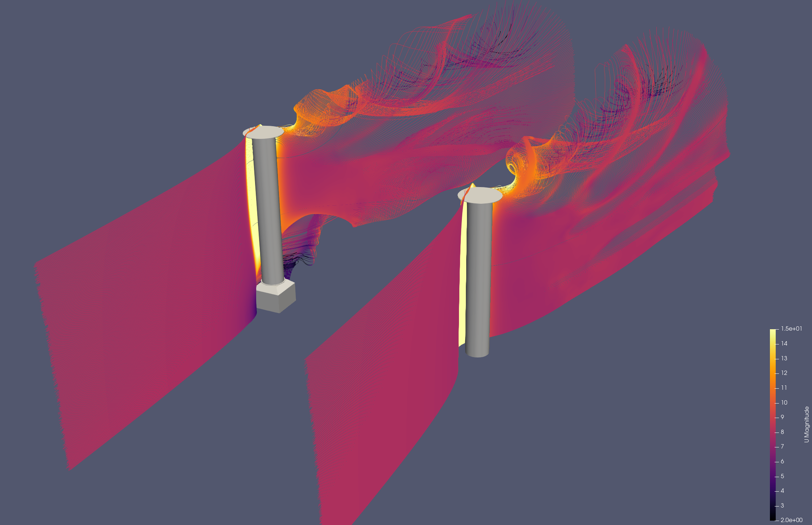

# Validation data

This chapter contains useful references for extracting data about the lift and drag on different wind propulsion devices, that, for instance, can be used to validate a simulation setup. The most relevant comparison data are from methods that can be considered to be *higher fidelity* than the methods in Stormbird. In other words, the articles below mostly contain data from either CFD, experiments, or some type of processing of full-scale measurements.

## Wing sails
### Relevant papers
- **[Comparison of full 3D-RANS simulations with 2D-RANS/lifting line method calculations for the flow analysis of rigid wings for high performance multihulls](https://www.sciencedirect.com/science/article/pii/S0029801814002637?via%3Dihub)** (2014), by K. Graf and more. Paper that contains experimental results for a single element wing sail and CFD results for a two-element wingsail.
- **[Rapid aerodynamic method for predicting the performance of interacting wing sails](https://www.sciencedirect.com/science/article/pii/S0029801823029803?via%3Dihub)** (2023) by K. Malmek and more. Paper about a lifting line method for wind propulsion devices, that also contains CFD data for validation purposes. The CFD results are particularly useful for validating interaction effects.
- **[Wind Tunnel Tests of a Two-Element Wingsail with Focus on Near-Stall Aerodynamics](https://onepetro.org/JST/article/9/01/110/569569/Wind-Tunnel-Tests-of-a-Two-Element-Wingsail-with)** (2024), by A. Hillenbrand and more. A paper about an experimental study of a two-element wing sail, with particular focus on how the stall angle is dependent on dynamic situations.

## Rotor sails

The flow around rotor sails are defined by very high lift coefficients and therefore strong tip vortices. They often come with end-plates to specifically reduce the tip losses, and thereby increase lift and reduce drag forces. CFD simulations done on rotor sails in the KSP WIND project indicate that the exact features of the *tip-geometry* can have large impact on the final results. For instance, the foundation geometry can have a large impact on the forces. These types of geometric details will not be part of a simplified line model of a rotor sails directly. As such, it is **generally necessary to tune the models to achieve the right combination of lift and drag**.

Tuning the lift can generally be done by adjusting the values of the lift coefficients in the sectional model, as the 3D lift is generally very close to the 2D lift for a rotor sail. This is because the lift is not dependent on the angle of attack, in the same way as for a wing sail or suction sail.

The recommended practice when modeling rotor sails is to first adjust the model of a single sail by comparing it to some high-fidelity data source, and then use the Stormbird library when, for instance, interaction effects are of interest.

### Relevant papers
- **[Application of the Magnus effect to the wind propulsion of ships](https://ntrs.nasa.gov/citations/19930090695)** (1926), by L. Prandtl. One of the first papers about rotor sails. The text mainly consists of a general discussion about the concept and the history of the first ship using rotor sails for propulsion, namely the *The Buckau*. However, there is also results from one of the first experiments of rotor sails in the appendix of the paper.
- **[Experiments on a Flettner rotor at critical and supercritical Reynolds numbers](https://www.sciencedirect.com/science/article/pii/S0167610518307396)** (2019), by G. Bordogna and more. Contains results from experiments where lift, drag and power coefficients on rotor sails where measured at different Reynolds numbers and spin ratios. **Note**: the experiments are performed in a wind tunnel where the rotor extends from the floor to the roof, which indicate that the force measurements should be interpreted as two-dimensional. However, it is mentioned in the article that there might be three-dimensional effects due to the boundary layer along the walls. The measured drag is also so large that there seem to be some three-dimensional effects present. The results are therefore probably most useful as a comparison for lift and power, while the drag values are a bit hard to interpret.
- **[Design, operation and analysis of wind-assisted cargo ships](https://doi.org/10.1016/j.oceaneng.2020.107603)** (2020), by F. Tillig and more. A paper about methods to set up empirical modeling of wind powered ships. One of the empirical methods presented is for the lift, drag and power consumption of rotor sails, tuned based on full-scale measurements.
- **[Retrofitting of Flettner Rotors – Results From Sea Trials of the General Cargo Ship "Fehn Pollux](https://www.intmaritimeengineering.org/index.php/ijme/article/view/1146/356)** (2020), by M. Vahs. A paper that really is about the how to analyze sea-trail data from a ship equipped with rotor sails. A part of the paper also contain wind tunnel measurements that originates from a bachelor thesis (original source not found), which gives lift and drag as a function of spin ratio.
- **[Levelling the Playing Field: A Numerical Platform for the Fair Comparison of Wind Propulsion Systems](http://data.hiper-conf.info/Hiper2022_Cortona.pdf)** (2022), by F. C. Gerhardt and more. A paper mostly about the need to have independent analysis of wind propulsion devices. As part of explaining the rotor sail models, CFD results of lift and drag as a function of spin ratio are presented. This presentation also includes a comparison against other available data sources.
- **[Calculation of Flettner rotor forces using lifting line and CFD methods](https://blueoasis.pt/wp-content/uploads/2023/10/Nutts2023_proceedings_v4.pdf)** (2023), by A. Östman and more. A paper that compares lifting line simulations against CFD simulations for rotor sails. As part of this, there is both two- and three-dimensional data for lift and drag. The two-dimensional data from this paper is used as the default values in the rotating cylinder sectional model in Stormbird.
- **Aerodynamics of the Flettner rotor at high Reynolds number** (2024), by F. Deybach and more. **Note**: not yet publicly available. Part of the RINA conference on wind propulsion in 2024. Contains experimental results, where a rotor sail is tested in a wind tunnel at different reynolds numbers and spin ratios, as well with different end plate configurations. Concludes that the lift is not very little sensitive to the Reynolds number.

### Other data sources
The KSP WIND project (the project funding the development of Stormbird) has performed CFD simulations of rotor sails as part of the project. These data are not yet published anywhere, except shown in the plots below. The primary goal of these simulations where to investigate the impact of the foundation on the lift and drag. The result indicate that the foundation can have a huge impact on the forces. A model that does not include the tip vortex on the bottom of the sails can, therefore, be overly optimistic.

<figure>
    
    <figcaption>Figure 1: Streamlines from CFD simulations of rotor sails with and without the foundation present, to illustrate the strength of the vortices, and the impact on the bottom tip vortex when the foundation is inclined in the simulation. Each version of the sail is simulated dependently, and then the streamlines are combined in post-processing</figcaption>
</figure>

### Plot of data

#### Three dimensional data

#### Two-dimensional data

## Suction sails
### Relevant papers
- **[Fondation Cousteau and windship propulsion - 1980 - 1985 - System Cousteau - Pechiney](https://www.jmwe.org/uploads/1/0/6/4/106473271/aa_suction_sails_turbosail_ventifoil_cousteau_report.pdf)** (1985), by B. Charrier and more. A paper about the original suction sail concept, known as turbo sails. Part of the presentation is lift and drag data from the sail for different suction rates based on wind tunnel measurements.
- **[Wind Propulsion for Merchant Vessels](https://repository.tudelft.nl/record/uuid:a681c8e6-552e-45a1-8657-893123a8e06b)** (2017). A master thesis about how to model ships with wind propulsion, that also contains CFD simulations of suction sails, compared against experimental data from the original Turbosail.
- **[A CFD Study on Wind Assisted Propulsion Technology for Commercial Shipping](https://www.researchgate.net/publication/355675684_A_CFD_Study_on_Wind_Assisted_Propulsion_Technology_for_Commercial_Shipping)** (2021), by W. Hopes and more. A paper about CFD modeling of suction sails, which includes data on lift and drag.
- **[Levelling the Playing Field: A Numerical Platform for the Fair Comparison of Wind Propulsion Systems](http://data.hiper-conf.info/Hiper2022_Cortona.pdf)** (2022), by F. C. Gerhardt and more. A paper mostly about the need to have independent analysis of wind propulsion devices. As part of explaining the suction sail model, CFD results of lift and drag for different suction rates and angles of attack is presented.
 -**[Aerodynamic optimization of the eSAIL, bound4blue’s suction sail for wind-assisted vessel propulsion](https://bound4blue.com/aerodynamic-optimization-of-the-esail/)** (2024), by A. Llopis and more. A paper about how the wind propulsion supplier bound4blue has optimized their design of a suction sail. The paper also includes both wind tunnel data and CFD data for the lift and drag as a function of angle of attack, for a few representative suction rates. 

#### Three dimensional data

#### Two dimensional data

