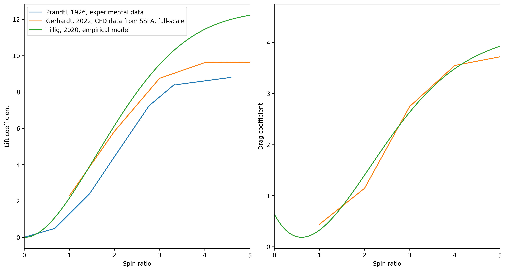

# Validation data

This chapter contains useful references for extracting data about the lift and drag on different wind propulsion devices, that, for instance, can be used to validate a simulation setup.

The most relevant comparison data are from methods that can be considered to be *higher fidelity* than the methods in Stormbird. In other words, the articles below is mostly methods that contain data from either CFD, experiments, or some type of processing of full-scale measurements.

For each sail category, there is first a list of papers, with a short recap of the content. Then, a comparison of the data in all papers are plotted.

## Wing sails
### Relevant papers
- **[Comparison of full 3D-RANS simulations with 2D-RANS/lifting line method calculations for the flow analysis of rigid wings for high performance multihulls](https://www.sciencedirect.com/science/article/pii/S0029801814002637?via%3Dihub)** (2014), by K. Graf and more. Paper that contains experimental results for a single element wing sail and CFD results for a two-element wingsail. 
- **[Wind Tunnel Tests of a Two-Element Wingsail with Focus on Near-Stall Aerodynamics](https://onepetro.org/JST/article/9/01/110/569569/Wind-Tunnel-Tests-of-a-Two-Element-Wingsail-with)** (2024), by A. Hillenbrand and more. A paper about an experimental study of a two-element wingsail, with particular focus on how the stall angle is dependent on dynamic situations.

## Rotor sails
### Relevant papers
- **[Application of the Magnus effect to the wind propulsion of ships](https://ntrs.nasa.gov/citations/19930090695)** (1926), by L. Prandtl. One of the first papers about rotor sails. The text mainly consists of a general discussion about the concept and the history of the first ship using rotor sails for propulsion, namely the *The Buckau*. However, there is also results from one of the first experiments of rotor sails in the appendix of the paper. 
- **[Experiments on a Flettner rotor at critical and supercritical Reynolds numbers](https://www.sciencedirect.com/science/article/pii/S0167610518307396)** (2019), by G. Bordogna and more. Contains results from experiments where lift and drag on rotor sails where measured at different Reynolds numbers and spin ratios.
- **[Design, operation and analysis of wind-assisted cargo ships](https://www.sciencedirect.com/science/article/pii/S0029801820306077)** (2020), by F. Tillig and more. A paper about methods to set up empirical modelling of wind powered ships. One of the empirical methods presented is for the lift, drag and power consumption of rotor sails, tuned based on full-scale measurements.
- **[Retrofitting of Flettner Rotors – Results From Sea Trials of the General Cargo Ship "Fehn Pollux](https://www.intmaritimeengineering.org/index.php/ijme/article/view/1146/356)** (2020), by M. Vahs. A paper that really is about the how to analyze sea-trail data from a ship equipped with rotor sails. A part of the paper also contain wind tunnel measurements that originates from a bachelor thesis (original source not found), which gives lift and drag as a function of spin ratio.
- **[Levelling the Playing Field: A Numerical Platform for the Fair Comparison of Wind Propulsion Systems](http://data.hiper-conf.info/Hiper2022_Cortona.pdf)** (2022), by F. C. Gerhardt and more. A paper mostly about the need to have independent analysis of wind propulsion devices. As part of explaining the rotor sail models, CFD results of lift and drag as a function of spin ratio are presented.

A plot of some of the data in the above references can be seen below:

## Suction sails
### Relevant papers
- **[Fondation Cousteau and windship propulsion - 1980 - 1985 - System Cousteau - Pechiney](https://www.jmwe.org/uploads/1/0/6/4/106473271/aa_suction_sails_turbosail_ventifoil_cousteau_report.pdf)** (1985), by B. Charrier and more. A paper about the original suction sail concept, known as turbo sails. Part of the presentation is lift and drag data from the sail for different suction rates based on wind tunnel measurements.
- **[Wind Propulsion for Merchant Vessels](https://repository.tudelft.nl/record/uuid:a681c8e6-552e-45a1-8657-893123a8e06b)** (2017). A comprehensive master thesis about how to model ships with wind propulsion, that also contains CFD simulations of suction sails, compared against experimental data from the original turbosail.
- **[A CFD Study on Wind Assisted Propulsion Technology for Commercial Shipping](https://www.researchgate.net/publication/355675684_A_CFD_Study_on_Wind_Assisted_Propulsion_Technology_for_Commercial_Shipping)** (2021), by W. hopes and more. A paper about CFD modelling of suction sails, which includes data on lift and drag.
- **[Levelling the Playing Field: A Numerical Platform for the Fair Comparison of Wind Propulsion Systems](http://data.hiper-conf.info/Hiper2022_Cortona.pdf)** (2022), by F. C. Gerhardt and more. A paper mostly about the need to have independent analysis of wind propulsion devices. As part of explaining the suction sail model, CFD results of lift and drag for different suction rates and angles of attack is presented.

