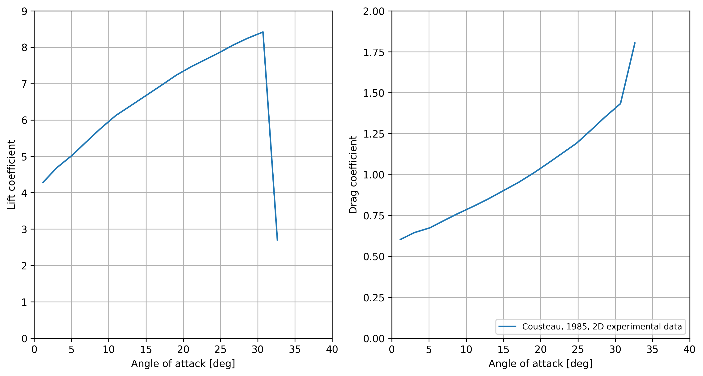
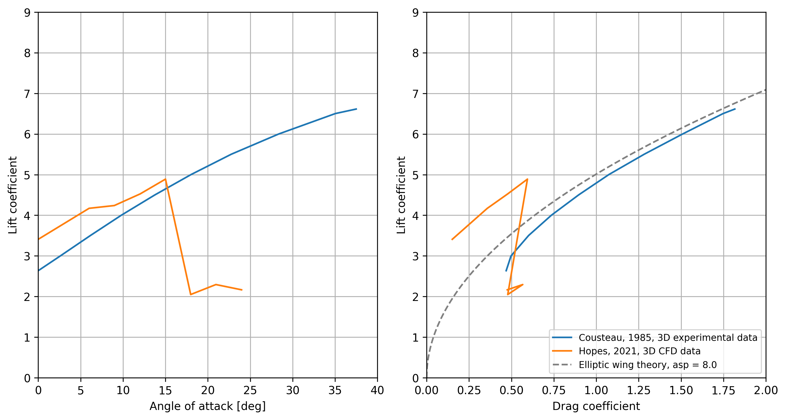

# Validation data

This chapter contains useful references for extracting data about the lift and drag on different wind propulsion devices, that, for instance, can be used to validate a simulation setup. The most relevant comparison data are from methods that can be considered to be *higher fidelity* than the methods in Stormbird. In other words, the articles below mostly contain data from either CFD, experiments, or some type of processing of full-scale measurements.

## Wing sails
### Relevant papers
- **[Comparison of full 3D-RANS simulations with 2D-RANS/lifting line method calculations for the flow analysis of rigid wings for high performance multihulls](https://www.sciencedirect.com/science/article/pii/S0029801814002637?via%3Dihub)** (2014), by K. Graf and more. Paper that contains experimental results for a single element wing sail and CFD results for a two-element wingsail.
- **[Rapid aerodynamic method for predicting the performance of interacting wing sails](https://www.sciencedirect.com/science/article/pii/S0029801823029803?via%3Dihub)** (2023) by K. Malmek and more. Paper about a lifting line method for wind propulsion devices, that also contains CFD data for validation purposes. The CFD results are particularly useful for validating interaction effects.
- **[Wind Tunnel Tests of a Two-Element Wingsail with Focus on Near-Stall Aerodynamics](https://onepetro.org/JST/article/9/01/110/569569/Wind-Tunnel-Tests-of-a-Two-Element-Wingsail-with)** (2024), by A. Hillenbrand and more. A paper about an experimental study of a two-element wingsail, with particular focus on how the stall angle is dependent on dynamic situations.

## Rotor sails
### Relevant papers
- **[Application of the Magnus effect to the wind propulsion of ships](https://ntrs.nasa.gov/citations/19930090695)** (1926), by L. Prandtl. One of the first papers about rotor sails. The text mainly consists of a general discussion about the concept and the history of the first ship using rotor sails for propulsion, namely the *The Buckau*. However, there is also results from one of the first experiments of rotor sails in the appendix of the paper. 
- **[Experiments on a Flettner rotor at critical and supercritical Reynolds numbers](https://www.sciencedirect.com/science/article/pii/S0167610518307396)** (2019), by G. Bordogna and more. Contains results from experiments where lift, drag and power coefficients on rotor sails where measured at different Reynolds numbers and spin ratios. **Note**: the experiments are performed in a wind tunnel where the rotor extends from the floor to the roof, which indicate that the force measurements should be interpreted as two-dimensional. However, it is mentioned in the article that there might be three-dimensional effects due to the boundary layer along the walls. The measured drag is also so large that there seem to be some three-dimensional effects present. The results are therefore probably most useful as a comparison for lift and power, while the drag values are a bit hard to interpret. 
- **[Design, operation and analysis of wind-assisted cargo ships](https://www.sciencedirect.com/science/article/pii/S0029801820306077)** (2020), by F. Tillig and more. A paper about methods to set up empirical modelling of wind powered ships. One of the empirical methods presented is for the lift, drag and power consumption of rotor sails, tuned based on full-scale measurements.
- **[Retrofitting of Flettner Rotors – Results From Sea Trials of the General Cargo Ship "Fehn Pollux](https://www.intmaritimeengineering.org/index.php/ijme/article/view/1146/356)** (2020), by M. Vahs. A paper that really is about the how to analyze sea-trail data from a ship equipped with rotor sails. A part of the paper also contain wind tunnel measurements that originates from a bachelor thesis (original source not found), which gives lift and drag as a function of spin ratio.
- **[Levelling the Playing Field: A Numerical Platform for the Fair Comparison of Wind Propulsion Systems](http://data.hiper-conf.info/Hiper2022_Cortona.pdf)** (2022), by F. C. Gerhardt and more. A paper mostly about the need to have independent analysis of wind propulsion devices. As part of explaining the rotor sail models, CFD results of lift and drag as a function of spin ratio are presented. This presentation also includes a comparison against other available data sources.
- **[Calculation of Flettner rotor forces using lifting line and CFD methods](https://blueoasis.pt/wp-content/uploads/2023/10/Nutts2023_proceedings_v4.pdf)**, by A. Östman and more. A paper that compares lifting line simulations against CFD simulations for rotor sails. As part of this, there is both two- and three-dimensional data for lift and drag. The two-dimensional data from this paper is used as the default values in the rotating cylinder sectional model in Stormbird.

### Examples of data

Examples of two-dimensional force coefficients for a spinning cylinder is shown in the plot below:

#### Figure 1: Force coefficients for a 2D spinning cylinder

Examples of three-dimensional force coefficients for an actual rotor sail is shown in the plot below. The drag values are also compared against the theoretical induced drag for an elliptic wind, according to simplified lifting line theory, where the effective aspect ratio is set to be similar to the data extracted from the papers. This comparison indicates that lift-induced drag is the dominating drag source for high lift-coefficients. **Note**: the max lift coefficient for a rotor sail varies quite a lot between different sources, even when the aspect ratio and Reynolds numbers are similar. This therefore indicate that this value is somewhat uncertain. 

#### Figure 2: Force coefficients for a 3D rotor sail

## Suction sails
### Relevant papers
- **[Fondation Cousteau and windship propulsion - 1980 - 1985 - System Cousteau - Pechiney](https://www.jmwe.org/uploads/1/0/6/4/106473271/aa_suction_sails_turbosail_ventifoil_cousteau_report.pdf)** (1985), by B. Charrier and more. A paper about the original suction sail concept, known as turbo sails. Part of the presentation is lift and drag data from the sail for different suction rates based on wind tunnel measurements.
- **[Wind Propulsion for Merchant Vessels](https://repository.tudelft.nl/record/uuid:a681c8e6-552e-45a1-8657-893123a8e06b)** (2017). A master thesis about how to model ships with wind propulsion, that also contains CFD simulations of suction sails, compared against experimental data from the original turbosail.
- **[A CFD Study on Wind Assisted Propulsion Technology for Commercial Shipping](https://www.researchgate.net/publication/355675684_A_CFD_Study_on_Wind_Assisted_Propulsion_Technology_for_Commercial_Shipping)** (2021), by W. Hopes and more. A paper about CFD modelling of suction sails, which includes data on lift and drag.
- **[Levelling the Playing Field: A Numerical Platform for the Fair Comparison of Wind Propulsion Systems](http://data.hiper-conf.info/Hiper2022_Cortona.pdf)** (2022), by F. C. Gerhardt and more. A paper mostly about the need to have independent analysis of wind propulsion devices. As part of explaining the suction sail model, CFD results of lift and drag for different suction rates and angles of attack is presented.

### Examples of data

Data from the original [Turbosail](https://en.wikipedia.org/wiki/Turbosail) from Charrier et al. (1985) seem to still be the primary data source used in open research. The other papers above typically try to reproduce the same values, only with CFD. That is, the references mentioned do not provide new insight into the performance of the suction sail directly, but attempts reproduce the same values using CFD.  **Important note**: newer producers of suctions sails, such as [Bound4Blue](https://bound4blue.com/) and [Econowind](https://econowind.nl/) uses different designs than the Turbosail, and claim better performance. The Turbosail data should therefore be interpreted as a *lower-estimate* on the performance of a modern suction sail. However, at the moment, we don't know about any *openly available source* that document this directly. 

#### Figure 3: Force coefficients for a 2D suction sail section

#### Figure 4: Force coefficients for a 3D suction sail

