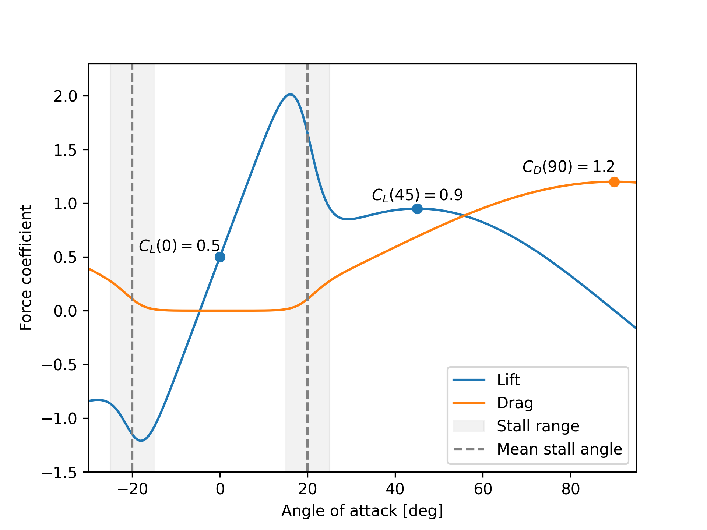

# Foil model

The single element foil model is a *parametric model* of a foil section. That is, it is defined using a (relatively) few parameters that are later used in a simple mathematical model to compute lift and drag for arbitrary angles of attack.

## Why a parametric model?
Other implementations of lifting line and actuator line methods often use data based models for computing the lift and drag coefficients. That is, the user must supply data on how the lift and drag varies as a function of the angle attack, and then the solver can use this data together with interpolation or table look-up to compute force coefficients for arbitrary angles. 

A data based approach is often fine, and does have some benefits. For instance, it is the only way to make a truly general model where the user have full control over the behavior of the sectional model. For this reason, there might be implementations of pure data based models in Stormbird in the future. However, the choice of using a parametric model for now where based on two core reason. 

First, it becomes easier to use a parametric model as a building block for more complex foil models, where the behavior depends on some internal state, such as flap angle or suction rate. This is because the model parameters can be allowed to depend on the internal state through interpolation. See the [varying foil sub chapter](./varying_foil_model.md) for more on this.

Second, a parametric model ensures smoothness, which is beneficial when using the model together with gradient based optimization algorithms. For instance, such a method might be used to optimize the angle of attack for wing sails at a given wind direction. The smoothness is in particular practical when the expected optimal point is close to the stall angle.

The downside of a parametric model is believed to be small, as long as the model can represent typical foil section behavior without too many simplifications.

## Model overview
The model is divided in two core sub-models, labeled *pre-stall* and *post-stall*.

For angles of attack below stall, it is assumed that both lift and drag can be represented accurately as simple polynomials. The lift is mostly linear, but can also have an optional high-order term where both the factor and power of the term is adjustable. The drag is assumed to be represented as a second order polynomial.

For angles of attack above stall, both the lift and drag are assumed to be harmonic functions which primarily is adjusted by setting the *max value* after stall. This is a rough model, which is assumed to be appropriate as the pre-stall behavior is usually more important for a wind power device.

The transit between the two models is done using a sigmoid function, where both the transition point and the width of the transition can be adjusted.

In addition, there factors in the model to account for added mass and lift due to the time derivative of the angle of attack. Both these effects are assumed to be linear for simplicity.

## Available parameters

A view of the available fields in the `Foil` model is seen below, with further explanation of each parameter right after:

```rust
pub struct Foil {
    pub cl_zero_angle: f64,
    pub cl_initial_slope: f64,
    pub cl_high_order_factor: f64,
    pub cl_high_order_power: f64,
    pub cl_max_after_stall: f64,
    pub cd_zero_angle: f64,
    pub cd_second_order_factor: f64,
    pub cd_max_after_stall: f64,
    pub cd_power_after_stall: f64,
    pub mean_stall_angle: f64,
    pub stall_range: f64,
    pub cl_changing_aoa_factor: f64,
    pub added_mass_factor: f64,
}
```

An explanation of the parameters are given below:

- `cl_zero_angle`: Lift coefficient at zero angle of attack. This is zero by default, but can be set to a non-zero value to account for camber, flap angle or boundary layer suction/blowing.
- `cl_initial_slope`: How fast the lift coefficient increases with angle of attack, when the angle of attack is small. The default value is \\( 2 \pi \\) , which should always be the values used for a normal foil profile - with or without camber and flap - but it can also be set to different value for instance to account for boundary layer suction/blowing.
- `cl_high_order_factor`: Optional proportionality factor for adding higher order terms to the lift. Is zero by default, and therefore not used. Can be used to adjust the behavior of the lift curve close to stall.
- `cl_high_order_power`: Option power for adding higher order terms to the lift. Is zero by default, and therefore not used. Can be used to adjust the behavior of the lift curve close to stall.
- `cl_max_after_stall`: The maximum lift coefficient after stall.
- `cd_zero_angle`: Drag coefficient at zero angle of attack
- `cd_second_order_factor`: Factor to give the drag coefficient a second order term. This is zero by default.
- `cd_max_after_stall`: The maximum drag coefficient after stall.
- `cd_power_after_stall`: Power factor for the harmonic dependency of the drag coefficient after stall. Set to 1.6 by default.
- `mean_stall_angle`: The mean stall angle, which is the mean angle where the model transitions from pre-stall to post-stall behavior. The default value is 20 degrees.
- `stall_range`: The range of the stall transition. The default value is 6 degrees.
- `cl_changing_aoa_factor`: Factor to model lift due to the time derivative of the angle of attack. This is zero by default, and therefore not used.
- `added_mass_factor`: Factor to model added mass due to accelerating flow around the foil. Set to zero by default.

## Example

An example of the output of a foil model is shown below, along with definition of the parameters used.

